# Измерение производительности сайта Samsung

## Окружение

Все измерения производились в браузере Chrome в режиме инкогнито с отключенными плагинами:

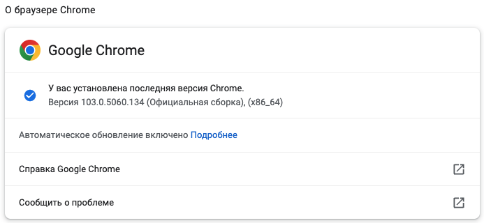

ОС:

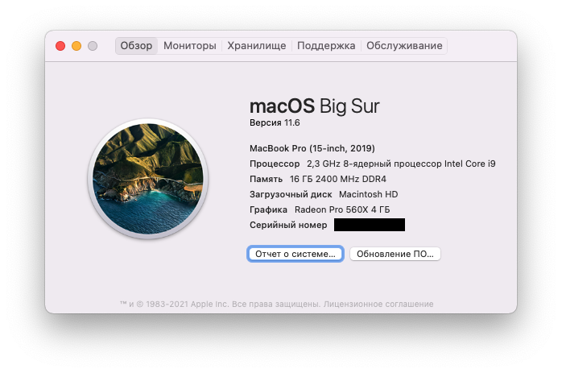

## Network

[HAR файл загрузки сайта](./media/www.samsung.com.har)
Файл сделан после того, как сайт был прокручен сверху вниз для загрузки всех медиа
ресурсов

### Дублирование ресурсов

#### https://vk.com/js/api/openapi.js

Дублируется данный ресурс, различаются только query параметры. То, что ресурсы идентичны
можно сравнить по размеру контента и заголовкам ответа

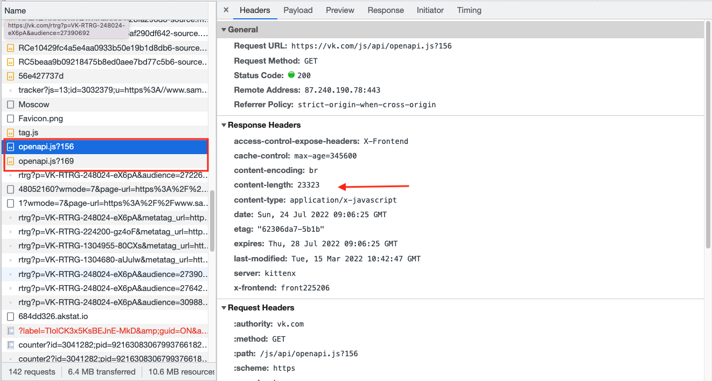

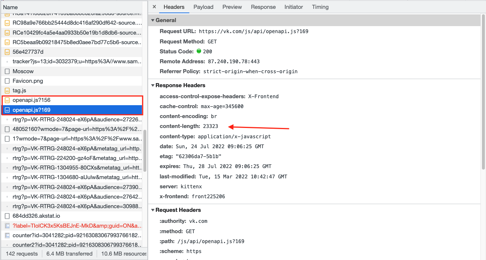

#### Запросы к рекламным трекерам

Дважды отправляются запросы к рекламным трекерам

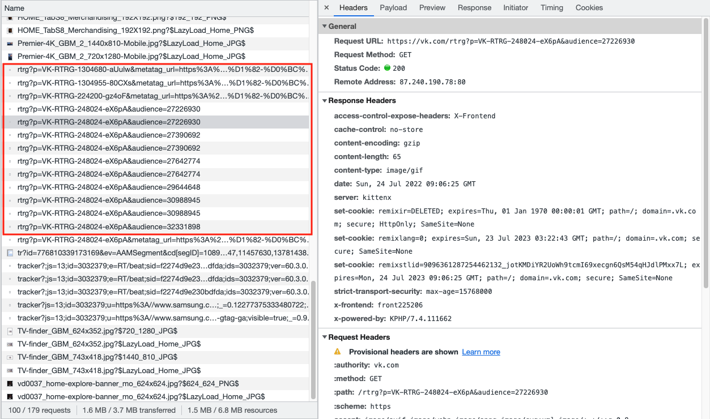

### Лишний размер ресурса

#### Похожие картинки

Сайт загружает два варианта картинки с различным разрешением 624x352 и
743x418. Картинки схожи по разрешению и соотношению сторон, поэтому один из ресурсов лишний

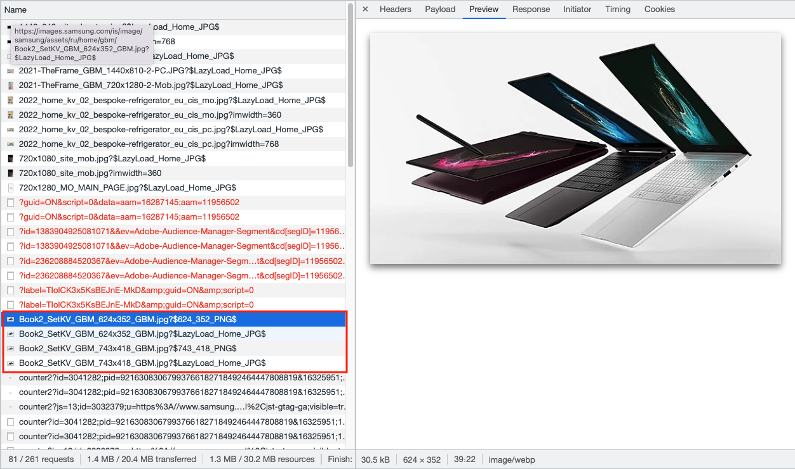

Аналогичная история здесь

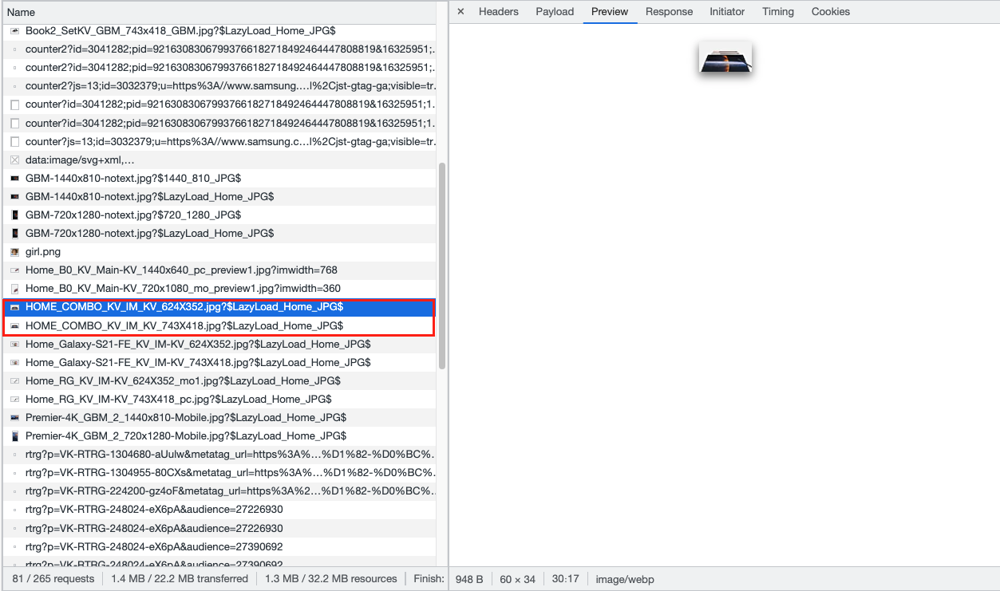

### Медленно загружающиеся ресурсы

Самые долгозагружаемые ресурсы - это ресурсы без ответа от сервера, тут кажется стоит сделать
меньше таймауты и очень долго загружается один из скриптов, в сравнении с остальными ресурсами

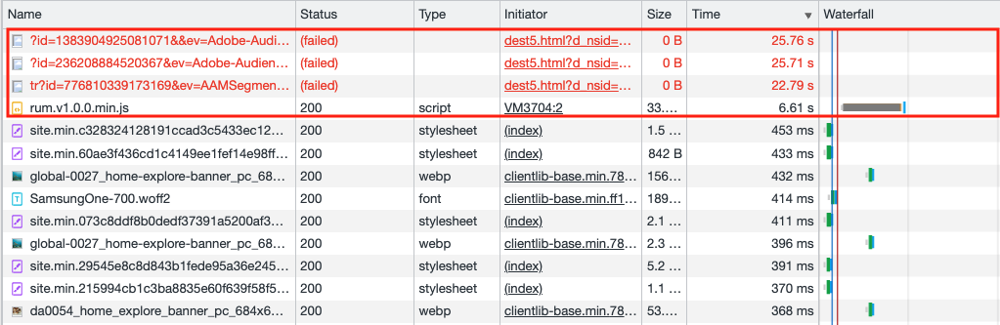

### Ресурсы, блокирующие загрузку

В самом начале загружается довольно много css файлов, из-за чего в очереди на
загрузку ожидается много JS скриптов. Ожидание составляет более 800мс. Из-за этого
ожидания первая отрисовка (FP) происходит на 800+ мс. Хорошим решением
было бы объединить
все стили в один файл и аналогичную процедуру сделать со скриптами

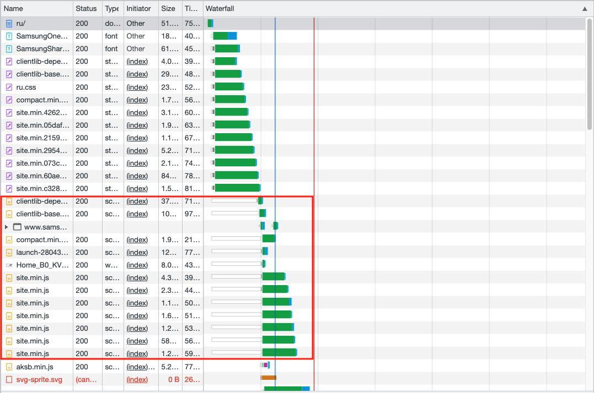

### Что-то еще

#### Повторяющиеся запросы к рекламному трекеру

Много запросов на один урл для трекинга, отличающийся только некоторыми частями пейлоада,
ресурс не сильно дублирующийся, но это явно место в оптимизацию которого можно посмотреть

Важно отметить, что трекеры вызываются практически одновременно

Стоит посмотреть в документацию трекера и скорее всего там найдется информация о том, как
слать данные сгруппировано, а не по отдельности

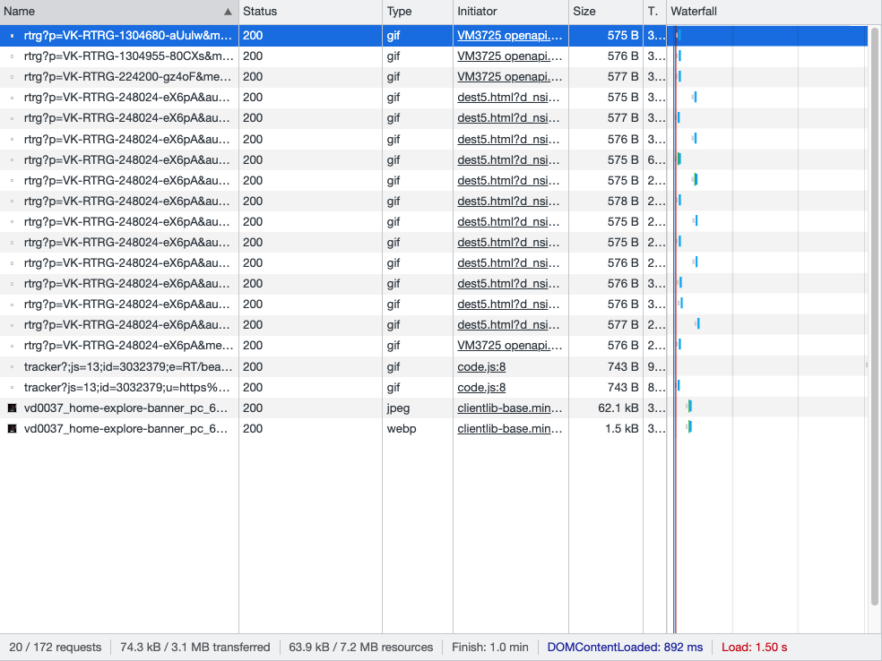

#### JPEG картинка

На сайте есть [картинка](https://images.samsung.com/is/image/samsung/assets/ru/tvs/1440x640_site_desctop.jpg?imwidth=768
) которая весит 200 кб, можно конверитировать ее в формат webp, как и остальные
картинки на сайте. Вес в webp будет составлять 132 кб. Это позволить передавать по
сети меньше трафика

## Performance

[Результаты](./media/samsung_perfomance_profile.json)

### Измерить время в миллисекундах от начала навигации до событий

| Метрика                  | Время, мс |
|--------------------------|-----------|
| First Paint              | 812.3     |
| First Contentful Paint   | 812.3     |
| Largest Contentful Paint | 893.3     |
| DCL                      | 1227.7    |
| Load Event               | 2137.2    |

### Определить, на каком DOM-элементе происходит LCP

На элементе img:

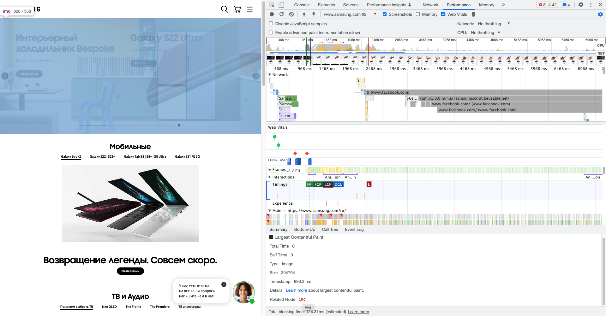

### Измерить, сколько времени в миллисекундах тратится на разные этапы обработки документа

| Метрика    | Время, мс |
|------------|-----------|
| Loading    | 31        |
| Scripting  | 758       |
| Rendering  | 96        |
| Painting   | 43        |

## Coverage

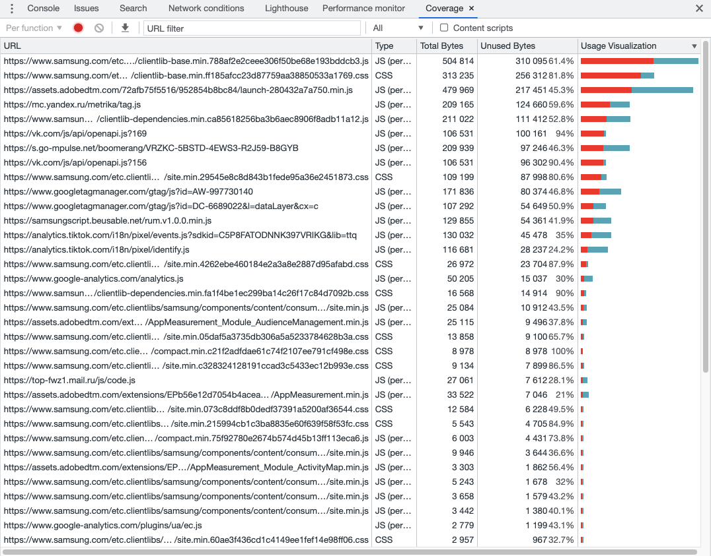

Неиспользуемый JS: 1389 кб

Неиспользуемый CSS: 420 кб

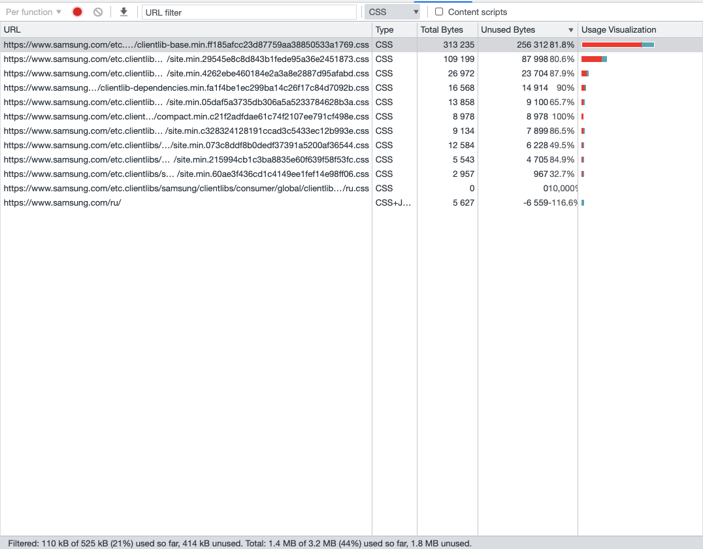
